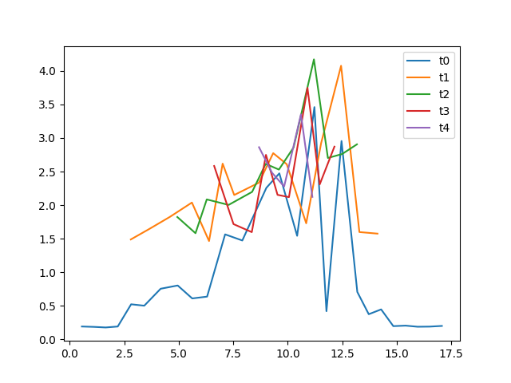

# Deploy Code Server with Hetzner Cloud

## To run the scrip make it executable 
```
chmod +x deploy.sh
```

## Then execute it 
```
./deploy.sh
```

The script will install all the neccesary packages and create server enviroment

---

### Example result of alternating traffic with load balancer



---
## When u want to delete server use cleaning script
```
chmod +x clean.sh
./clean.sh
```